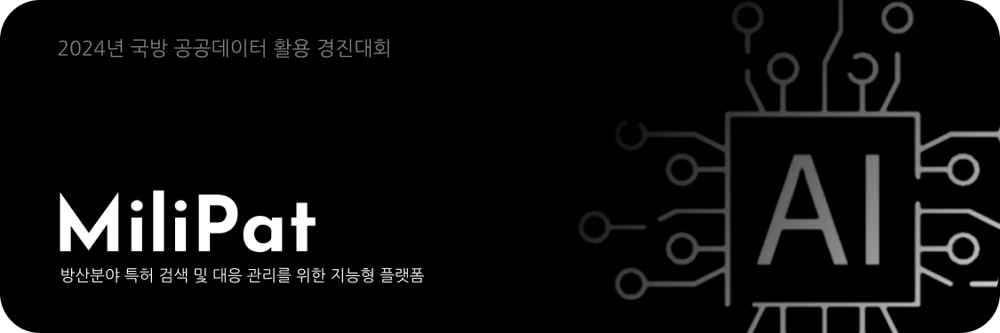

 
<b>핵심기능</b>
 

# Introduction
프로젝트에 대한 소개

방산 분야에서는 기술의 급속한 발전으로 인해 특허 등의 지적재산이 중요한 역할을 수행하고 있습니다. 이에 따라 기업들은 효율적인 특허 검색 및 대응 관리를 통해 경쟁우위를 확보하는 데 큰 관심을 가지고 있습니다. 이 프로젝트는 방산 분야에서의 특허 검색 및 관리를 지원하기 위한 지능형 플랫폼을 개발하는 것을 목표로 합니다.

 

### 1.1 프로젝트 목표

> 이 프로젝트의 주요 목표는 다음과 같습니다:
>
> * 효율적이고 정확한 방산 분야 특허 검색 시스템 구축
> * 사용자 친화적이며 간편한 국방규격 조회 시스템 구축
> * 특허 정보를 신속하게 분석하여 기업의 기술 대응 전략 수립 지원
> * 방산 분야의 국제적 특허 분쟁에 대한 민관협동 대응체널 구축

 

### 1.2 프로젝트 기대효과

> 이 프로젝트를 통해 다음과 같은 기대 효과를 얻을 수 있습니다:
>
> * 연구 및 개발에 필요한 정보에 대한 빠른 접근 가능
> * 방산 기업의 기술 대응 능력 강화 및 양질의 특허 출원 유도
> * 국제적 특허 분쟁 발생시 민관협력으로 효과적인 대응 가능
> * 지적재산의 효율적인 활용으로 글로벌 방산시장에서 경쟁 우위 확보

 
 
 

# Architecture
프로젝트에 대한 소개

### 2.1 활용한 데이터셋  

> |제공기관|활용데이터셋|
> |---|---|
> |국방부|[국방부_국방정보기술표준 목록](https://www.data.go.kr/data/3034718/openapi.do)
> |방위사업청|[방위사업청_보유 특허목록](https://www.data.go.kr/data/15118690/fileData.do)
> |방위사업청|[방위사업청_방산업체 지정현황](https://www.data.go.kr/data/15081929/fileData.do)
> |방위사업청|[방위사업청_국방규격공개 정보](https://www.data.go.kr/data/15089081/fileData.do)
> |방위사업청|[방위사업청_군수품 목록화 현황](https://www.data.go.kr/data/15070267/fileData.do)
> |AI hub|[논문자료 요약](https://www.aihub.or.kr/aihubdata/data/view.do?currMenu=115&topMenu=100&aihubDataSe=realm&dataSetSn=90)
> |AI hub|[도서자료 요약](https://www.aihub.or.kr/aihubdata/data/view.do?currMenu=115&topMenu=100&aihubDataSe=realm&dataSetSn=93)
> |AI hub|[특허 지식베이스](https://aihub.or.kr/aihubdata/data/view.do?currMenu=115&topMenu=100&aihubDataSe=realm&dataSetSn=113)

 

[그래프 신경망을 이용한 국방과학기술 융합 예측 양상](https://github.com/ztor2/patent_link_prediction?tab=readme-ov-file)

[특허분야 특화된 한국어 AI언어모델](https://github.com/kipi-ai/korpatbert)

 

### 2.2 시스템 아키텍처

> 2.2.1 데이터 수집 및 저장
> * 특허 데이터베이스와 연동하여 실시간으로 특허 정보 수집
> * 안정적이고 확장 가능한 데이터베이스 구축
>
> 2.2.2 지능형 특허 검색 엔진
> * 자연어 처리 기술을 활용하여 특허 문서 분석
> * 검색 쿼리에 대한 높은 정확도와 신속한 결과 제공
>
> 2.1.3 특허 대응 관리 시스템
> * 특허 분석 결과를 기반으로 기술 대응 전략 제시
> * 프로젝트 관리, 팀 협업, 일정 관리 등을 포함하는 사용자 친화적인 대응 관리 시스템 개발

 

### 2.3 핵심 기술

> 2.2.1 자연어 처리 (NLP)
> * 특허 문서의 의미를 이해하고 검색 효율을 높이기 위한 NLP 기술 활용
> * 특허 문서의 요약 및 유사도 분석을 위한 NLP 기술 활용   
>
> 2.2.2 기계 학습 (ML)
> * 사용자의 검색 패턴과 특허 대응 이력을 분석하여 사용자 맞춤형 서비스 제공
> * 특허 추세 및 기술 동향 예측을 위한 ML 모델 구축
>
> 2.2.3 웹 및 모바일 개발
> * 플랫폼은 웹 및 모바일에서 사용 가능하도록 개발하여 언제 어디서나 접근가능한 사용자환경 구축
> * websocket을 활용한 서버와의 실시간 스트림 채널 구축 

 
 
 

# Production

### 예산 및 리소스

> * 예산 및 리소스는 팀 규모, 기술 선택 등에 따라 유동적으로 조정될 수 있음
> * 팀 구성: 개발자, 프로젝트 매니저
> * 하드웨어 및 소프트웨어 인프라 구축에 필요한 예산 고려

 

### 프로젝트 일정

> | 단계	| 일정 |
> | --- | --- |
> 요구사항 분석 |	1주
> 시스템 설계 |	2주
> 데이터베이스 구축	| 3주
> 특허 검색 엔진 개발 |	6주
> 대응 관리 시스템 개발 |	6주
> 통합 및 테스트	| 4주
> 배포 및 유지보수 |	지속적으로 진행

 
 
 

# Hello, MiliPat
 

  <!--
  <strong>🏆 2023 제주특별자치도 도지사상 수상 작품 🏆</strong>
   
   -->
   
  <a href='https://github.com/ziweek/desirable-sea/blob/main/README.md'>
    KOREAN
  </a>
  &nbsp;|&nbsp;
  <a href='https://github.com/ziweek/desirable-sea/blob/main/README_EN.md'>
    ENGLISH
  </a>
   
   
  <strong>방산 분야 특허 탐색 및 AI 분석을 위한 지능형 플랫폼</strong>
   
  <strong>An Intelligent Platform for Patent Search and AI Analysis in the Defense Industry</strong>
   
   

  
  
  
  
   
  
  
   
  
  
  
  
  
  
  

 
 
  

  
  <strong>아래의 뱃지에서 프로토타입을 확인해보세요.<strong>
   
   
  
  
  

 
 

# 1. 개요

> [!NOTE]
> - 본 아이디어는, 대한민국 국방부에서 주최하는 [2024년도 국방 공공데이터 활용 경진대회](https://data.mnd.go.kr/mbshome/mbs/data)에 출품한 프로젝트입니다.
>   
> - 본 아이디어는, “방위사업청_보유_특허_데이터” 등의 국방 분야 공공데이터를 다면적으로 활용하고 온프레미스 환경의 LLM 앙상블 구조 및 실시간 구조도 3D 렌더링 기술을 적용하여, 국내외의 방산분야 특허를 조회하고 분석하여 양질의 방산특허를 유도하고 글로벌 방산시장에서 지적재산권 경쟁의 우위를 확보할 수 있는 지능형 플랫폼을 연구 및 개발하는 것입니다.

https://github.com/ziweek/milipat/assets/99459331/a662422c-393e-45a4-9d99-41071a16c481

<table>
  <tr>
     <td>
      

        국내외 방산 특허 조회 및 분석
      

    </td>
    <td>
      

        특허 유사도 분석 및 기술 동향 예측
      

    </td>
    <td>
      

        구조도 실시간 3D 렌더링
      

    </td>
  </tr>
   <tr>
    <td style="width:1/3;">
      
    </td>
    <td style="width:1/3;">
      
    </td>
    <td style="width:1/3;">
      
    </td>
  </tr>
</table>
 

 
 

# 2. 프로덕트

> [!IMPORTANT]
> 
 
<b>프로젝트 진행 현황</b>

>  
>
> - [x] 기획안 작성 완료 :ok_hand:
> - [x] 프론트엔드 개발 완료 :ok_hand:
> - [x] 벡엔드 개발 완료 :ok_hand:
> - [x] 머신러닝 서버 개발 완료 :ok_hand:
> - [x] 데이터베이스 구축 완료 :ok_hand:
> - [x] 소개자료 및 시연영상 제작 완료 :ok_hand:
>
> 

> [!tip]
> 
 
<b>프로토타입 설치 방법</b>

>  
>
> iOS에서 설치하는 방법:
>
>  1. iOS 기기에서 Safari를 열고 [PWA가 호스팅된 URL](https://desirable-sea.vercel.app/)로 이동합니다.
>  2. 화면 하단에 있는 공유 아이콘을 탭합니다.
>  3. 화면을 아래로 스크롤하여 "홈 화면에 추가"를 탭합니다.
>  4. 우측 상단의 "추가"를 탭합니다.
>
> Android에서 설치하는 방법:
> 
>  1. Android 기기에서 Chrome 브라우저를 열고 [PWA가 호스팅된 URL](https://desirable-sea.vercel.app/)로 이동합니다.
>  2. 화면 우측 상단의 세 점 메뉴를 탭합니다.
>  3. "홈 화면에 추가"를 탭합니다.
>  4. 우측 상단의 "추가"를 탭합니다.
> 

 
<b>핵심기능</b>
 

#### 1. 국내외 방산 특허 조회 및 분석
   
 <table>
   <tr>
     <td width="50%">
      
    </td>
    <td>
     
데이터 전처리 과정에서 초고해상도 이미지 개선 딥러닝 모델을 원본 데이터에 적용하여 해상도를 크게 개선할 수 있었습니다.

    </td>
  </tr>
</table>

 

#### 2. 특허 유사도 분석 및 기술 동향 예측

 <table>
   <tr>
     <td width="50%">
      
    </td>
    <td width="50%">
      
데이터 전처리 과정에서 초고해상도 이미지 개선 딥러닝 모델을 원본 데이터에 적용하여 해상도를 크게 개선할 수 있었습니다.

    </td>
  </tr>
</table>

 

#### 3. 구조도 실시간 3D 렌더링

 <table>
   <tr>
     <td width="50%">
      
    </td>
    <td width="50%">
     
데이터 전처리 과정에서 초고해상도 이미지 개선 딥러닝 모델을 원본 데이터에 적용하여 해상도를 크게 개선할 수 있었습니다.

    </td>
  </tr>
</table>

 
 

  
<b>아키텍처</b>
 

#### 프로덕트 아키텍처

 <table>
  <tr>
     <td>
      
    </td>
  </tr>
   <tr>
    <td width="50%">
           
본 프로젝트의 아키텍처는 데이터 전처리 수행 서버(초고해생도 이미지 개선 딥러닝 모델), 핵심 기능 수행 서버(소형 객체 식별 딥러닝 모델), 그리고 웹 어플리케이션(프론트엔드와 벡엔드 및 데이터베이스)으로 구성되어 있습니다.

    </td>
  </tr>
</table>

 

#### LLM 아키텍처

 <table>
  <tr>
     <td>
      
    </td>
  </tr>
   <tr>
    <td width="50%">
           
본 프로젝트의 아키텍처는 데이터 전처리 수행 서버(초고해생도 이미지 개선 딥러닝 모델), 핵심 기능 수행 서버(소형 객체 식별 딥러닝 모델), 그리고 웹 어플리케이션(프론트엔드와 벡엔드 및 데이터베이스)으로 구성되어 있습니다.

    </td>
  </tr>
</table>

 
 

# 3. 팀원

<table>
  <tr>
    <td width=80>
      
김지욱

    </td>
    <td width=1=150>
      

        
        
      

    </td>
    <td>
      

        "방산분야 특허 검색 및 대응 관리를 위한 지능형 플랫폼 개발" 주제로 국방 공공데이터 활용 공모전에 참여한 경험은 혁신적이고 전략적인 아이디어를 현실로 구현하는 과정에서 귀중한 배움을 안겨주었습니다. 팀원들과의 긴밀한 협업은 아이디어의 다양성과 전문성을 결합해 플랫폼의 핵심 기능을 강화하는 데 일조했습니다. 특허 검색과 대응 관리를 효율적으로 통합하면서도 사용자 중심의 UI/UX를 고려하는 것은 도전적이었지만, 이를 통해 현업에서의 실제 활용성을 높일 수 있었습니다.
      

    </td>
  </tr>
</table>

